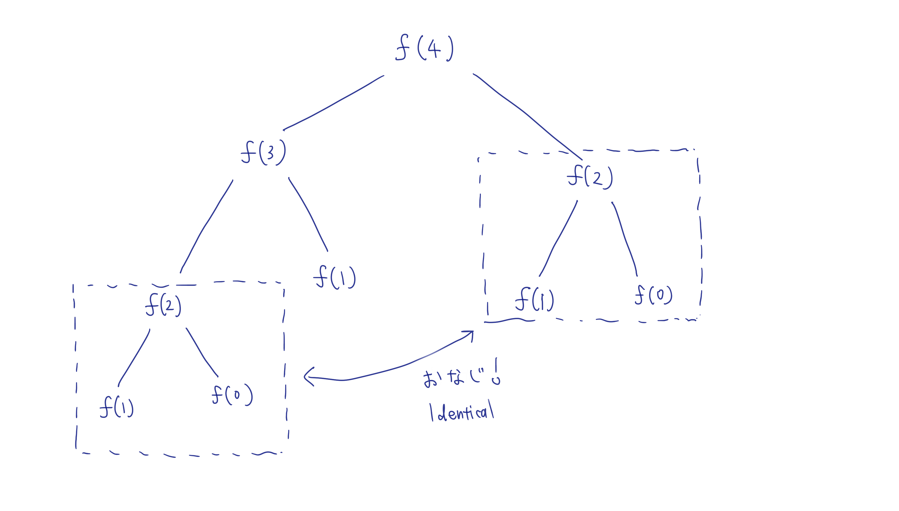

# Dynamic Programming Is All About Finding Recursion

## 1.1 フィボナッチ数列と再帰関数

最も有名な数列のうちの一つに、[フィボナッチ数列](https://en.wikipedia.org/wiki/Fibonacci_sequence)があります。フィボナッチ数列では何番目 (n > 2) の数を取ってきても、その数は1つ前の数と2つ前の値の合計になっています。

0, 1, 1, 2, 3, 5, 8, 13, 21, 34, 55, ...

と続いていくのですが、例えば8番目の数を見てみると、13 = 8 (7番目の数) + 5 (6番目の数) になっています。

f(n)をフィボナッチ数列におけるn番目の数を返す関数とおくと、0番目の数と1番目の数は例外として、n番目の数はn-1番目の数とn-2番目の数の合計なので

```
f(n) = {
    0, (nが1のとき)
    1, (nが2のとき)
    f(n - 1) + f (n - 2), (nが2より大きいとき)
}
```

と表されます。これをそのままプログラム(Python)にそのまま起こすと以下のようになります。

```
def fibonacci(n: int) -> int:
    assert n >= 1

    if n == 1:
        return 0
    elif n == 2:
        return 1
    else:  # n > 2
        return fibonacci(n - 1) + fibonacci(n - 2)
```

上記の`fibonacci`関数は`、fibonacci`関数自身を計算に使っているところが重要なところで、このように自分自身を呼び出す関数は再帰関数と呼ばれています。

ここで少し、中学生の時に習った「数学的帰納法」を思い出していただきましょう。中学時代の典型的な数学的帰納法の問題は、以下のように進んでいくことを覚えていらっしゃるでしょうか？

1. 示したいことが成り立つ数字をおく (例えばn = 1とか)
1. 一般的に、n = kのとき成り立つならn = k + 1のときも成り立つことを示す
1. n = 1 が成り立ち、n = k => n = k + 1 が成り立つので、帰納的に n = 2, 3, 4, 5, ... の時も成り立つ

個人的には、これをドミノのように捉えています。一般的に「あるドミノが倒れたら、次のドミノも倒れる」とき、最初のドミノさえ倒してしまえば次々とドミノが倒れていき、最終的には一番最後のドミノまでも倒すことができます。

さて、フィボナッチ数列を中学時代の数学的帰納法になぞらえて考えると以下のように表せます。

1. f(0) = 0, f(1) = 1 (0番目の値は0, 1番目の値は1)
1. n >= 2 のとき f(n) = f(n - 1) + f(n - 2) (フィボナッチ数列の定義より)
1. f(0)とf(1)からf(2)が計算でき、f(1)とf(2)からf(3)が計算でき、f(2)とf(3)からf(4)が計算でき、...

と、繰り返し同じステップを踏むことで何番目の数でも計算できるようになりました。

このように、再帰的に問題を考えることの利点は、一見大きく難しそうに見える問題も、小さなステップを踏むことに集中することで最終的に解決できるところです。例えば、フィボナッチ数列の100番の数を求めよ、と言われたら少し面食らってしまいますが、「100番目の値を求める」という問題を「99番目の数を求める」という問題と「98番目の数を求める」という問題に分解することで、問題をひとまわり小さくすることができます。問題を小さく小さくしていくと、最終的には答えを知っているフィボナッチ数列の1番目の数と2番目の数に行き着くので答えが求められます。

さて、4番目の数を手計算で計算してみようとすると、下記の通りになります。

```
f(4) = f(3) + f(2)
     = (f(2) + f(1)) + (f(1) + f(0))
     = ((f(1) + f(0)) + f(1)) + (f(1) + f(0))
     = ((1 + 0) + 1) + (1 + 0)
     = 3
```

数がどんどん小さくなって、最終的にはf(1) = 1 と f(0) = 0 で全てを表すことができました。しかし、手計算でフィボナッチ数列を求めるのはなんとも面倒です。こういったときに機械（プログラム）の出番です。今一度再帰関数を使ったプログラムを見てみると、私たちは

```
return fibonacci(n - 1) + fibonacci(n - 2)
```

とだけ記述して、面倒な繰り返し作業をプログラムにやらせています。単純作業はプログラムにやらせると便利ですし、再帰的に書くことでプログラムをとてもシンプルにまとめることができました。

### まとめ

- 再帰的に考えることで大きな問題を小さなステップに分解しよう
- 繰り返し作業はプログラムにやらせよう

## 1.2 プログラムで再帰的にフィボナッチ数列を求めることの問題点

ただ、前節のアプローチはこのままでは問題があります。今一度、f(4)を分解していくとどうなるか見てみましょう

```
f(4) = f(3) + f(2)
     = (f(2) + f(1)) + f(2)
```
f(2)が2回も登場していることがわかるように、同じ項を複数回計算してしまっていることがわかります。これをTreeで描いてみるとみると以下のようになります。



多少計算がダブってしまうだけで何が問題なの？と思いますが、木構造のNodeの数を数えてみるとわかります。フィボナッチ数列のn番目の数を求めたいとき、木の高さはだいたいnになります。また、ほぼ全てのNodeから2つのNodeに枝分かれするので、この木のNodeの数は、初項1、公比2の等比数列の合計値になりますね。

(TODO): draw

公式にそのまま当てはめると

```
(木の中のNodeの数) = (初項) * (公比^n - 1) / (公比 - 1)
                   = 1 * (2^n - 1) / (2 - 1)
                   = 2^n
```

となります。なので、フィボナッチ数列でn番目の数を前述のアプローチで求めようとすると、だいたい2^n回繰り返しのステップを踏むことになります。情報科学的に表現すると、前節のプログラムの計算量はO(2^n)と表されます。このO(2^n)はとんでもない計算量で、競技プログラミングの世界などでは絶対に避けるべきものになります。これはy = 2 ^ xのグラフを描いてみるとイメージしやすいです。

(TODO): draw

このように y = a ^ x で表される関数は指数関数と呼ばれていて、値の上昇具合がべらぼうに大きいことで知られています。例えば、フィボナッチ数列の5番目の値を求めるくらいならだいたい2 ^ 5 = 32回の計算で済むのですが、10番目の値を求めようとすると2 ^ 10 = 1024で、もう既に手計算でできるものではありません。ちょっと入力する数字が大きくなっただけで計算量が膨大になってしまうようなプログラムは好ましくありませんよね。

実際に私のM3 MacBook Proで走らせて時間を計測してみると以下のようになりました

```
fibonacci(10): 0.0000050067901611328125 (秒)
fibonacci(20): 0.00040984153747558594
fibonacci(30): 0.04945206642150879
fibonacci(40): 5.612907886505127
fibonacci(50): 50 704.3497741222382 (11分!!!)
```

50番目なんてすぐ求まりそうなのに、私のコンピュータではもう悲鳴をあげ始めています。この調子だと60番目の数字など、個人のPCではもう計算できません。

### まとめ

- 計算量が指数関数なのは避けるべき

## 1.3 再帰関数の問題の解決
